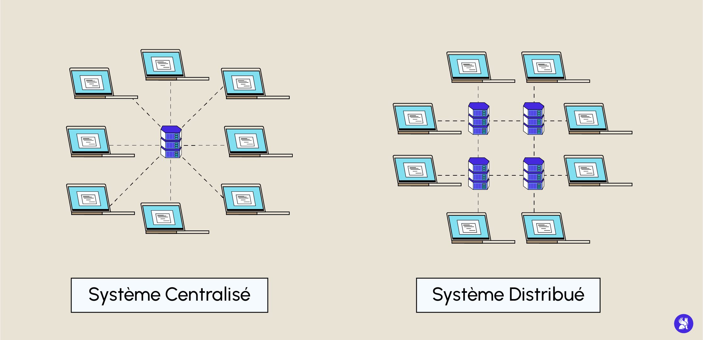

# Cours les bonnes pratiques du web
## Introduction
Ce cours est axé sur différents points :
- Le versionning et l'utilisation de GIT

## GIT et versionning
### Introduction
C'est une stratégie permettant via des outils tel que GIT de centraliser le traval d'une équipe tout en le versionnant et donc d'enregistrer les modifications du code source apportées tout au long de la vie du projet et du code. 

Le versionning permet d'avoir une traçabilité efficace de notre projet apportant des métadonnées précises (auteur du commit, date du commit, ...)

Grâce au versionning nous pouvons notamment: 
- de revenir en arrière en cas d'erreurs bloquante
- comparer les changements au fil des versions
- déterminer l'auteur du commit
- travailler en équipe sur un même projet.

### Mots clés du versionning
- traçabilité
- collaboration
- backup & rétablissement
- branching & merging

### Nomenclature de versionning
`MAJEURE.MINEURE.CORRECTIF`

- MAJEURE: Changements incompatibles avec les versions antérieurs
- MINEURE: Ajouts de fonctionnalités
- CORRECTIF: Fix et patch de bug 

### Différents système de versionning
#### SVN (Subversion)
C'est un système de version utilisant un modèle centralisé.
C'est un modèle nécessitant une connexion au réseau afin d'apporter des modifications au code source. 
Si le serveur est perdu alors tout l'historique l'est également. 

Les commit au sein de SVN sont atomiques :
**toutes les modifications sont appliquées ou aucune ne l'est**

**Remarque :** *Un commit est une opération locale*

#### GIT 
C'est un système distribué ce qui signifie que la source du code source est multiple.

### GIT en détails
GIT, a pour principale différence avec les autres SCMs, considère chaque modification comme une suite de succession.
GIT sauvegarde des snapshots et donc l'intégralité du code à un moment T donné. 

**La quasi-totalité des actions GIT sont locales**